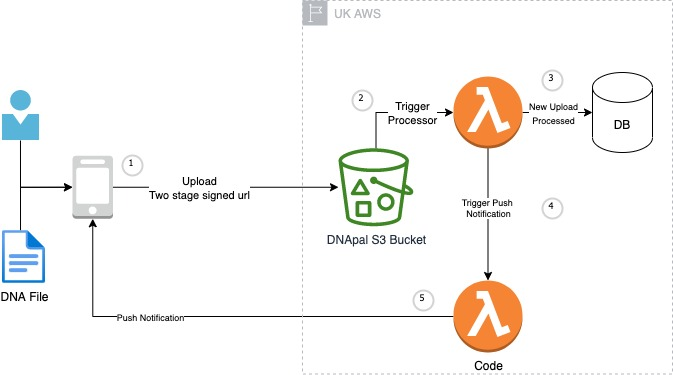

# PoC for uploading RAW DNA files to S3, triggering a process event

Using serverless architecture, allow frontend to securely upload a raw file to s3. The upload will trigger an event to process the new file.

